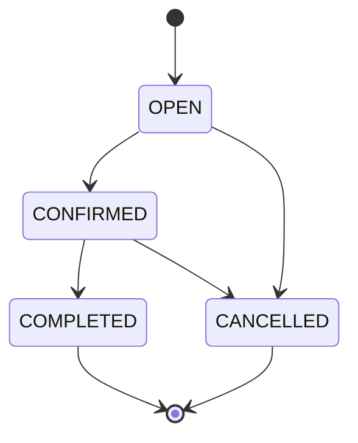

# Test

## Something

### My Diagram

```mermaid
graph TD;
    A-->B;
    A-->C;
    B-->D;
    C-->D;
```

### Another diagram

```mermaid
stateDiagram-v2
    OPEN %% PENDING
    CONFIRMED %% PROC
    COMPLETED %% CMPLT
    CANCELLED %% CANCEL


    [*] --> OPEN

    OPEN --> CONFIRMED
    OPEN --> CANCELLED

    CONFIRMED --> COMPLETED
    CONFIRMED --> CANCELLED

    %%COMPLETED --> CANCELLED
    COMPLETED --> [*]

    CANCELLED --> [*]
```
